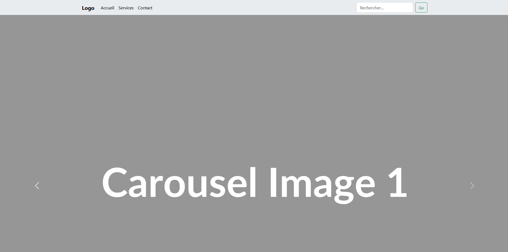
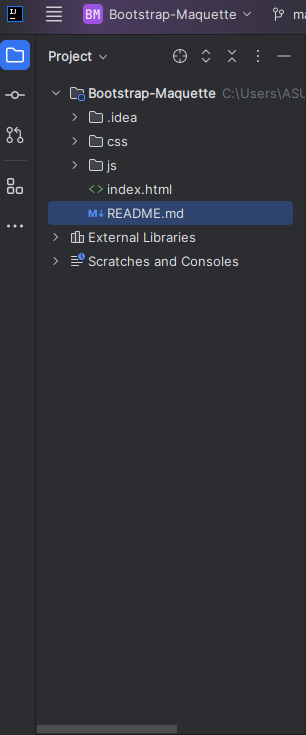
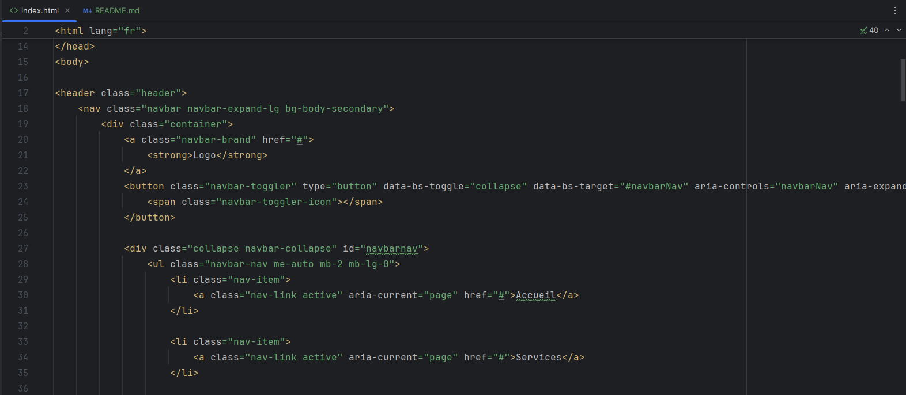
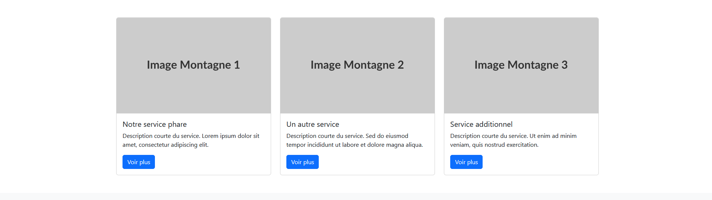
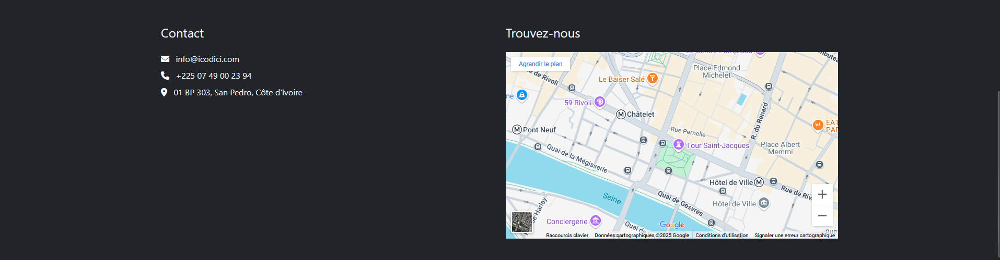

<h1>Maquettage Responsive - Wireframe --> Code (Bootstrap)</h1>

<h3>
Ce projet est un TP concret de l'intégration d'une maquette web, depuis les croquis initiaux dessinés à la main jusqu'à un site web fonctionnel, esthétique et entièrement responsive. L'objectif était de traduire une vision de design en code HTML et CSS propre en s'appuyant sur le framework Bootstrap 5.
</h3>
<h3>1. Création du projet Angular</h3>

 
<h3>2. Single page principale avec le Header</h3>

 

 
<h3>3. Ajout du Caroussel</h3>

 
<h3>4. Ajout de la section cards</h3>

 
<h3>5. Ajout de la section "Notre équipe"</h3>

 
<h3>6. Ajout de la section "Contact"</h3>

